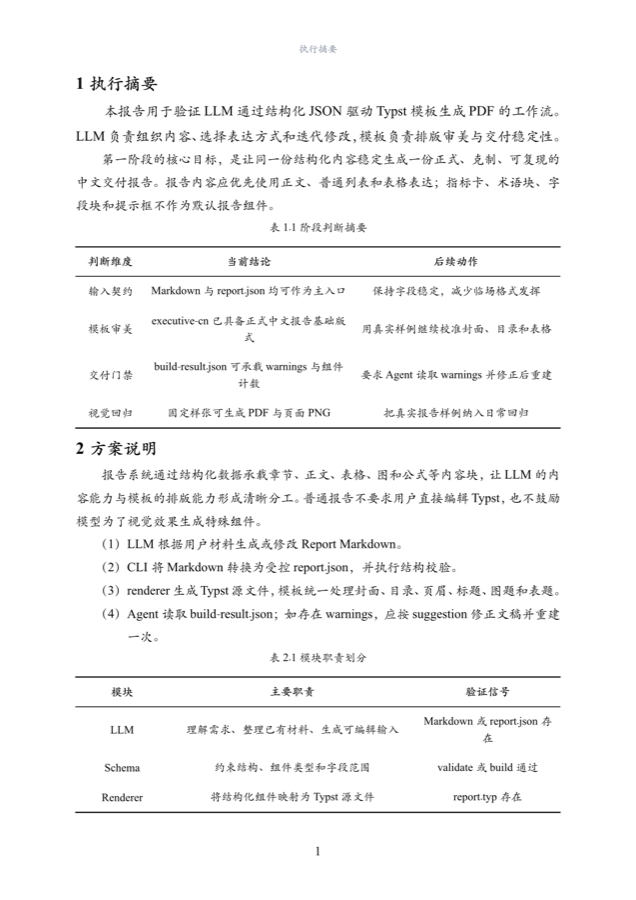
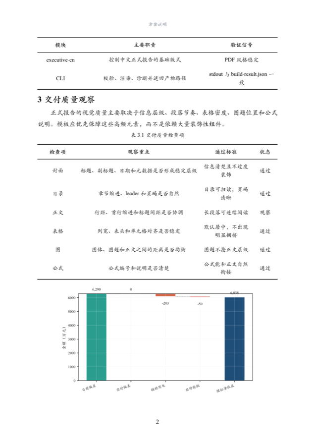
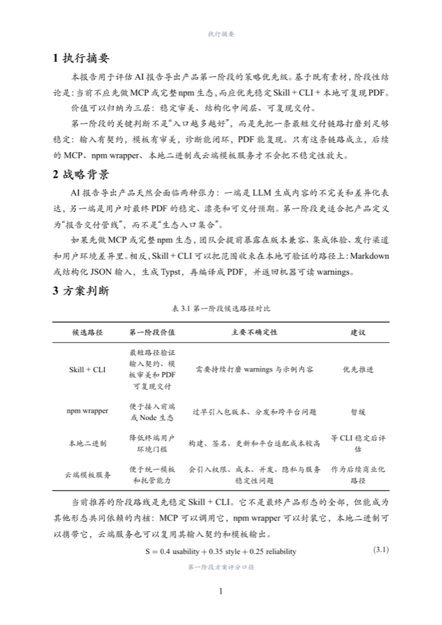
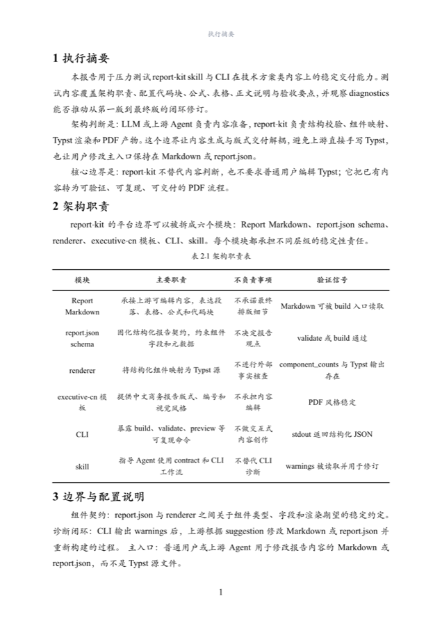

<h1 align="center">ReportKit</h1>

<p align="center">Report export for agents</p>

<p align="center">
  <a href="README.md">中文</a>
  ·
  <a href="#install">Install</a>
  ·
  <a href="#quick-start">Quick Start</a>
  ·
  <a href="#preview">Preview</a>
</p>

<p align="center">
  
  
</p>

---

Users provide source material or a report goal. The agent organizes the content, and ReportKit exports the final result as a stable, deliverable PDF report.

Users can provide any material the agent can read and understand, such as:

- Documents, spreadsheets, web pages, screenshots, or existing reports.
- Project materials, research notes, meeting notes, or data summaries.
- A clear report topic for the agent to research and organize.

## Preview

These screenshots show ReportKit's default report output.

| | | |
|:---:|:---:|:---:|
| <sub><strong>Cover</strong></sub> | <sub><strong>Body and tables</strong></sub> | <sub><strong>Figures and tables</strong></sub> |
|  |  |  |
| <sub><strong>Long tables</strong></sub> | <sub><strong>Strategy reports</strong></sub> | <sub><strong>Technical reports</strong></sub> |
|  |  |  |

## Install

### 1. Install the CLI

```bash
npm install -g @dztabel/reportkit
report-kit --version
```

Output like this means the CLI is installed:

```text
report-kit 0.1.27
```

### 2. Install one agent skill

#### 2.1 Codex

```bash
git clone https://github.com/dztabel-happy/reportkit-cli.git
cd reportkit-cli

node -e "const fs=require('fs'),os=require('os'),path=require('path');const src=path.join(process.cwd(),'skills','codex','typst-report-kit');const dest=path.join(os.homedir(),'.agents','skills','typst-report-kit');fs.rmSync(dest,{recursive:true,force:true});fs.mkdirSync(path.dirname(dest),{recursive:true});fs.cpSync(src,dest,{recursive:true});console.log('Codex skill installed');"
```

Check the Codex skill in your terminal:

```bash
node -e "const fs=require('fs'),os=require('os'),path=require('path');const p=path.join(os.homedir(),'.agents','skills','typst-report-kit','SKILL.md');if(!fs.existsSync(p))process.exit(1);console.log('Codex skill installed');"
```

This output means the skill is installed:

```text
Codex skill installed
```

Open Codex and type `$typst-report-kit`. If you can select the skill with `Tab`, it is ready. If it does not appear, press `Cmd+K` / `Ctrl+K`, choose `Force Reload Skills`, or reopen Codex.

#### 2.2 Claude Code

```bash
git clone https://github.com/dztabel-happy/reportkit-cli.git
cd reportkit-cli

node -e "const fs=require('fs'),os=require('os'),path=require('path');const src=path.join(process.cwd(),'.claude','skills','typst-report-kit');const dest=path.join(os.homedir(),'.claude','skills','typst-report-kit');fs.rmSync(dest,{recursive:true,force:true});fs.mkdirSync(path.dirname(dest),{recursive:true});fs.cpSync(src,dest,{recursive:true});console.log('Claude Code skill installed');"
```

Check the Claude Code skill in your terminal:

```bash
node -e "const fs=require('fs'),os=require('os'),path=require('path');const p=path.join(os.homedir(),'.claude','skills','typst-report-kit','SKILL.md');if(!fs.existsSync(p))process.exit(1);console.log('Claude Code skill installed');"
```

This output means the skill is installed:

```text
Claude Code skill installed
```

Open Claude Code and type `/typst-report-kit`. If you can select the skill, it is ready. If it does not appear, run `/reload-skills` and try again. Older Claude Code versions may need a new window.

## Quick Start

### 1. Generate a report from provided material

```text
$typst-report-kit Read my uploaded Excel, PDF, and meeting notes, then turn them into a formal project review report and export it as PDF.
/typst-report-kit Read my uploaded Excel, PDF, and meeting notes, then turn them into a formal project review report and export it as PDF.
```

### 2. Research a topic and generate a report

```text
$typst-report-kit Research recent developments in China's energy storage industry, organize the findings into an industry report, and export it as PDF.
/typst-report-kit Research recent developments in China's energy storage industry, organize the findings into an industry report, and export it as PDF.
```

### 3. Turn a rough draft into a deliverable report

```text
$typst-report-kit Rewrite this rough draft into a clear formal analysis report and export it as PDF.
/typst-report-kit Rewrite this rough draft into a clear formal analysis report and export it as PDF.
```

### 4. Revise a generated report from feedback

```text
$typst-report-kit Compress the report you just generated to 8 pages, rewrite chapter 2 for management readers, and export a new PDF.
/typst-report-kit Compress the report you just generated to 8 pages, rewrite chapter 2 for management readers, and export a new PDF.
```

The agent handles source reading, research, writing, formatting, and PDF export.

## Technical Details

Layout quality is guaranteed by ReportKit itself:

- Tables, figures, and equations are auto-numbered per chapter (表 2.1 / 图 3.1), and prose references such as 见表 x.x / 如图 x.x / 式 x.x render as clickable cross-references.
- Ordered entries in a final 资料来源 (sources) chapter render as [1] [2] reference entries, and inline [n] citations become clickable superscripts.
- Table column widths and font size are resolved from measured content: descriptive columns widen, short columns stay compact, and the dense tier is used only when content cannot fit.
- Builds return structured errors/warnings: provable defects such as dangling references fail the build with actionable fix hints.

The agent turns the material into ReportKit-ready intermediate content and runs:

```bash
report-kit build prepared-report.md --out ./report
```

ReportKit outputs:

```text
report/report.pdf
report/report.json
report/report.typ
report/<template-id>.typ
report/render-result.json
report/build-result.json
```

## Troubleshooting

The public beta supports macOS Apple Silicon, Linux x64, and Windows x64.

If global npm install skips optional dependencies, install the matching platform package explicitly:

```bash
# macOS Apple Silicon
npm install -g @dztabel/reportkit @dztabel/reportkit-darwin-arm64

# Linux x64
npm install -g @dztabel/reportkit @dztabel/reportkit-linux-x64

# Windows x64
npm install -g @dztabel/reportkit @dztabel/reportkit-win32-x64
```

When reporting a build failure, include:

- `report-kit --version`
- `report/build-result.json`
- A minimal `content.md` that reproduces the issue

## Changelog

See [`CHANGELOG.md`](CHANGELOG.md).

## Repository Scope

This public repository contains npm wrapper metadata, the command shim, public skills, documentation, and lightweight preview assets.

Renderer source, private templates, schemas, visual regression samples, and platform binaries are not included here. Platform binaries are distributed through npm platform packages.

## License

ReportKit is distributed through npm as a proprietary CLI binary. This repository provides the public wrapper, skills, and documentation for installing and using the CLI.
